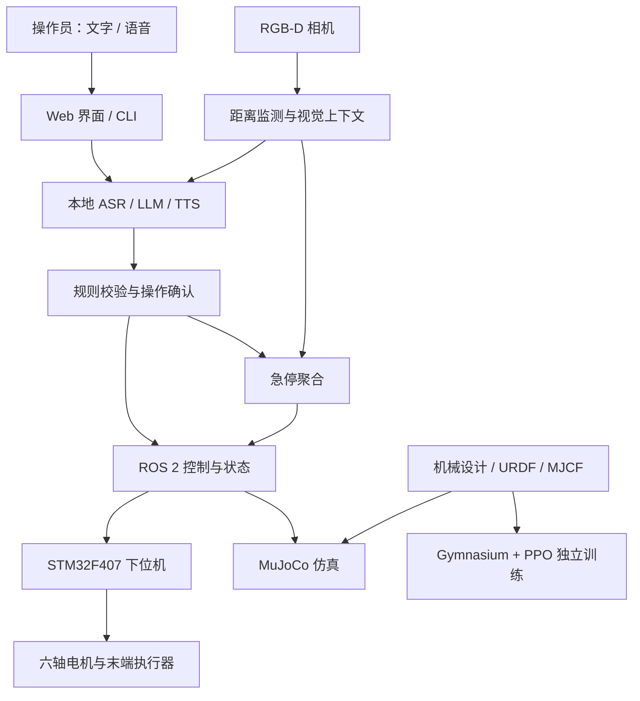

# twist001 · 六轴机械臂与自然语言协作系统

面向机械臂建模、控制与人机协作的研究原型，包含机械结构设计、MuJoCo 仿真、PPO 强化学习、ROS 2 控制、STM32 下位机，以及本地语音与视觉助手源码。

仓库由两部分组成：**`model/` 提供机械设计与独立仿真实验，`arm/` 提供控制器、感知和交互系统**。

## 项目内容

| 模块 | 内容 | 代码与资料 |
| --- | --- | --- |
| 机械结构 | 六轴机械臂零件、装配体、加工模型、打印工程和材料清单 | [model/3D](model/3D/)、[材料清单](model/机械臂材料清单.xlsx) |
| 仿真与学习 | URDF / MJCF 模型、MuJoCo 演示、Gymnasium 环境与 PPO 训练 | [model/RL/src](model/RL/src/) |
| 运动控制 | 逆运动学、关节目标控制、串口状态反馈和手眼标定 | [arm/ROS2/src/control](arm/ROS2/src/control/)、[main](arm/ROS2/src/main/) |
| 视觉与停机处理 | RGB-D 距离估计、视觉快照、多来源急停聚合 | [arm/ROS2/src/camera](arm/ROS2/src/camera/) |
| 本地 AI 交互 | OpenVINO 模型适配、Whisper 语音识别、语音合成、规则确认和 Web 界面 | [arm/safe](arm/safe/)、[arm/code](arm/code/) |
| 嵌入式控制 | STM32F407 固件、CAN 电机通信、气泵与 OLED 控制、PCB 工程 | [arm/STM32](arm/STM32/) |

当前发布包含源码和设计资料；模型权重、训练策略、运行环境及部分外部资源需要单独准备。目录适配情况见下方「当前集成说明」。

## 系统结构

下图概括各模块的连接关系；完整链路需要在目标设备上配置和验证。



## 目录结构

```text
twist001/
├── README.md
├── LICENSE
├── arm/
│   ├── code/                 # 模型、语音和 Web 入口及测试
│   ├── safe/                 # 本地 AI 助手、规则与 ROS 2 桥接
│   ├── ROS2/
│   │   └── src/
│   │       ├── arm_asset/    # 机器人模型与网格
│   │       ├── arm_gui/      # 状态与操作界面
│   │       ├── camera/       # 相机、距离监测与视觉上下文
│   │       ├── control/      # IK、DRL 与手眼标定
│   │       ├── main/         # 启动文件、状态机与急停聚合
│   │       └── mujoco_sim/   # ROS 2 / MuJoCo 仿真节点
│   ├── STM32/               # 固件、原理图与立创 EDA 工程
│   └── scripts/             # Web 与 ROS 2 启动辅助脚本
└── model/
    ├── 3D/
    │   ├── sw/              # SolidWorks 零件与装配体
    │   └── 加工/             # CNC / 打印用 STEP 与 3MF 文件
    ├── RL/src/              # 独立仿真、训练与测试代码
    │   ├── arm.py
    │   ├── demo.py
    │   └── model/           # MJCF、URDF、STL 与纹理
    └── 机械臂材料清单.xlsx
```

## 快速开始：独立仿真

建议先从 `model/` 的独立仿真入口了解机械臂模型。以下命令以具有桌面显示环境的 Linux 主机为例，无需启动 ROS 2 或连接实体机械臂。

### 1. 获取代码并建立环境

```bash
git clone https://github.com/luolisen/twist001.git
cd twist001
python3 -m venv .venv
source .venv/bin/activate
python -m pip install --upgrade pip
python -m pip install mujoco numpy
```

### 2. 打开 MuJoCo 演示

```bash
cd model/RL/src
python demo.py
```

脚本使用相对于当前工作目录的模型路径，因此需要在 `model/RL/src/` 内运行。演示打开 MuJoCo 查看器并运行约 5 分钟；默认未启用随机关节控制。

### 3. PPO 训练与测试

在同一虚拟环境中补充训练依赖：

```bash
python -m pip install scipy gymnasium "stable-baselines3[extra]" torch
```

训练入口为 [`model/RL/src/arm.py`](model/RL/src/arm.py)。直接执行该文件会使用底部的配置：

| 参数 | 当前入口默认值 | 用途 |
| --- | --- | --- |
| `TRAIN_MODE` | `True` | 训练；改为 `False` 后加载策略进行测试 |
| `MODEL_PATH` | `./model_set` | 策略保存或加载路径 |
| `n_envs` | `64` | 并行环境数 |
| `total_timesteps` | `100_000_000` | 训练总步数 |

首次运行请先降低并行数和训练步数，例如将入口中的 `n_envs` 改为 `4`、`total_timesteps` 改为 `100_000`，再在 `model/RL/src/` 下执行：

```bash
python arm.py
```

训练代码使用 `fork` 创建子进程，原生 Windows 需要调整启动方式。代码按 CUDA 可用性选择 GPU 或 CPU；中断训练时会尝试保存带 `_interrupted` 后缀的策略。测试前需准备已训练的策略文件。

环境接口、奖励与模型说明见 [model/README.md](model/README.md)。

## ROS 2 与实体控制

ROS 2 工作空间位于 **`arm/ROS2/`**。现有文档以 ROS 2 Jazzy 为基线；配置好 ROS 2、`colcon` 和各包依赖后，可从仓库根目录构建：

```bash
source /opt/ros/jazzy/setup.bash
cd arm/ROS2
colcon build
source install/setup.bash
```

| 入口 | 用途 |
| --- | --- |
| [arm_ik_sim.launch.py](arm/ROS2/src/main/launch/arm_ik_sim.launch.py) | IK 与 MuJoCo 仿真 |
| [arm_drl_sim.launch.py](arm/ROS2/src/main/launch/arm_drl_sim.launch.py) | DRL 策略与 MuJoCo 仿真 |
| [arm.launch.py](arm/ROS2/src/main/launch/arm.launch.py) | 控制、实体状态、相机与急停聚合 |
| [handeye_calibration.launch.py](arm/ROS2/src/main/launch/handeye_calibration.launch.py) | 手眼标定 |

运行前需核对启动文件中的本机路径和资源配置。DRL 节点需要额外提供 `policy.zip`；相机节点需要匹配的 SDK 与视觉模型。接口和节点说明见 [ROS 2 文档](arm/ROS2/readme.md)。

STM32 固件的 Keil 工程位于 [`arm/STM32/Control_Code/MDK-ARM/test.uvprojx`](arm/STM32/Control_Code/MDK-ARM/test.uvprojx)，CubeMX 配置位于 [`test.ioc`](arm/STM32/Control_Code/test.ioc)。电路、协议与固件说明见 [STM32 文档](arm/STM32/README.md)。

## 当前集成说明

当前上传版本保留了部分旧工程路径，完整系统尚需目录与环境适配：

| 旧文档或源码中的名称 | 当前实际目录 | 影响 |
| --- | --- | --- |
| `Code/` | `arm/code/` | 配置路径与启动脚本仍有旧名称引用，Linux 下大小写敏感 |
| `local_safety_assistant/` | `arm/safe/` | Python 入口和内部导入仍使用旧包名，直接启动 AI / Web 入口会受影响 |
| `ros2/` | `arm/ROS2/` | Web 联合启动脚本的默认工作空间路径需要适配 |

此外，部分 launch 文件保留了 `/home/robot/...` 路径，相机配置保留了 `/home/inteldk/...` 路径；随仓库提供的相机扩展文件名标注为 CPython 3.10 / Linux x86_64，需要与实际 Python 和系统架构匹配。

本地虚拟环境、模型权重与缓存不随此次上传提供。子目录 README 保留了原工程说明，其中的旧路径、环境和测试结论不能直接视为当前发布版本的运行验证。此首页按当前文件结构编写，未对完整 AI、ROS 2 或实体机械臂链路作运行验收。

## 文档导航

- [机械结构、仿真与强化学习](model/README.md)
- [机械臂协作系统概述](arm/README.md)
- [AI 命令入口与测试](arm/code/README.md)
- [本地助手、规则与交互核心](arm/safe/README.md)
- [ROS 2 节点与通信接口](arm/ROS2/readme.md)
- [STM32 控制器与硬件设计](arm/STM32/README.md)
- [启动脚本说明](arm/scripts/README.md)

## 使用范围

本项目用于研究、教学与原型验证。实体机械臂运行前需完成零位、限位、接线和急停链路验证；软件急停与 AI 判断不能替代独立的硬件保护。

## 许可证

仓库根目录提供 [Apache License 2.0](LICENSE)。第三方驱动、SDK、模型及素材按其各自附带的许可证或授权说明使用。
