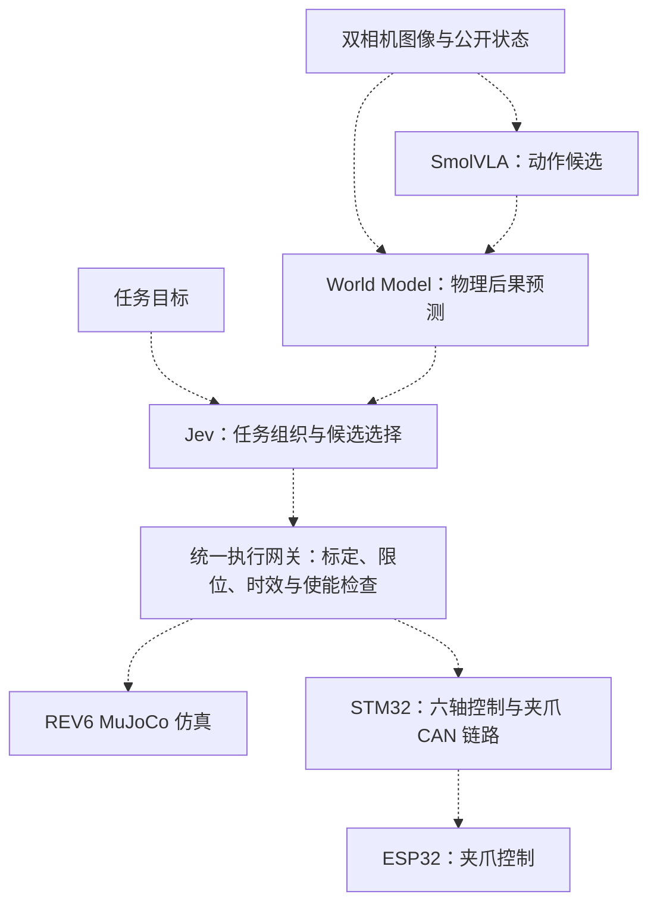

# twist001 · 六轴机械臂与具身智能实验

围绕自建六轴机械臂、双指夹爪和双相机开展建模、控制与具身智能实验。当前仓库以 **STM32 六轴固件、ESP32 夹爪固件、REV6 双相机 MuJoCo 仿真**为基础，保留三模型训练归档及机械设计资料。

本页按 2026-10-08 已核实的本地工程与仓库发布内容整理。源码构建、仿真烟测、模型评估和实机验证分别记录，不将它们视为同一项验收。

## 当前模块

| 模块 | 仓库内容 | 状态与入口 |
| --- | --- | --- |
| STM32 六轴控制 | FinalIntegration v3.0，STM32F407VG，X42S CAN、示教/回放、夹爪链路 | 重新编译通过；[构建说明](arm/STM32/README.md) |
| ESP32 夹爪控制 | 配套纯 P 控制、端点减速、反向制动、CAN 节点 7、Wi-Fi/BLE 夹爪接口 | 重新编译通过；[配置与构建](arm/ESP32/README.md) |
| REV6 仿真 | 六轴机械臂、完整夹爪、前置与腕部相机、基础及方块任务场景 | 加载、渲染及短步数数值检查通过；[使用说明](model/RL/README.md) |
| 三模型训练归档 | VLA → WM → Jev 方向及 WM19 训练、核验、独立评分记录 | 归档的物理可靠性门槛未通过；[实验记录](model/three_model_training/README.md) |
| ROS 2 | 既有节点及已同步的 REV6 MuJoCo 资源 | 当前更新未进行 ROS 2 整链路验收；[集成边界](arm/README.md) |
| 机械资料 | SolidWorks、STEP、打印工程、材料清单及 PCB 资料 | 历史资料，尚未逐项核对与 REV6 的一致性；[机械资料说明](model/README.md) |

## 架构方向与集成状态

三模型按不同职责协作：**SmolVLA 提出动作候选，World Model 预测候选动作的物理后果，Jev 结合任务目标选择、拒绝或重新规划**。方向说明及实现边界见[三模型归档](model/three_model_training/README.md)。这不是已经完成的端到端三模型闭环系统。

计划中的执行关系如下；虚线表示尚待统一接入或验证的环节：



本地 FinalIntegration 工程另有 `host/alan_robot` 主机控制层与独立 ROS 桥接包，**尚未纳入本仓库此次发布**。仓库中的既有 ROS 2 节点不能直接等同于这套新执行层。固件源码中已有配套 CAN 协议；新固件尚未烧录或完成实机联合验证。

## 快速开始：REV6 双相机仿真

从仓库根目录执行，使用独立 Python 环境：

```bash
python -m venv .venv
source .venv/bin/activate
python -m pip install -r model/RL/requirements.txt

# 基础机械臂与相机场景
python model/RL/src/demo.py

# 方块与放置目标场景
python model/RL/src/demo.py --scene task

# 离屏渲染两路图像并进行 100 步数值检查
python model/RL/src/demo.py --check /tmp/rev6-camera-check
```

上述环境激活命令适用于 macOS/Linux。macOS 打开交互窗口时，将 `python` 换为环境中的 `mjpython`；离屏检查使用普通 Python。

### 当前相机版本

| 相机 | 垂直视角 | 仿真原始图像 | 策略图像 | 处理方式 |
| --- | --- | --- | --- | --- |
| 前置 `front_rgb` | 48° | 640×360 | 256×256 | 完整视野缩为 256×144，上下各补 56 像素 |
| 腕部 `wrist_camera` | 45.2° | 640×360 | 512×512 | 完整视野缩为 512×288，上下各补 112 像素 |

该版本基于 REV6 Camera45.2，并加入实拍参考的前置相机姿态对齐。保留完整 16:9 视野，不以中心裁剪替代；逐设备内参、畸变与实机全运动可见性仍待验证。

模型来源、原始及发布文件指纹见 [provenance.json](model/RL/provenance.json)，相机合同见 [camera_contract.json](model/RL/camera_contract.json)。基础场景的桌板为视觉几何，任务场景的桌板有碰撞几何。旧独立 PPO 入口已被当前仿真包替换。

## 固件构建

### STM32F407VG

准备 ARM GNU 工具链和 CMake，在仓库根目录执行：

```bash
cmake -S arm/STM32/Control_Code -B /tmp/twist001-stm32-build \
  -DCMAKE_TOOLCHAIN_FILE="$PWD/arm/STM32/Control_Code/cmake/arm-gcc.cmake"
cmake --build /tmp/twist001-stm32-build -j4
```

工具链目录可通过 `STM32_ARM_TOOLCHAIN` 指定，详见 [STM32 文档](arm/STM32/README.md)。

### ESP32 夹爪

准备 Arduino CLI 和 esp32 core 3.3.11，在仓库根目录执行：

```bash
python3 arm/ESP32/tools/provision_wireless.py
arduino-cli compile --fqbn esp32:esp32:esp32doit-devkit-v1 \
  --build-property build.partitions=huge_app \
  --build-property upload.maximum_size=3145728 \
  --build-path /tmp/twist001-esp32-build arm/ESP32/ESP32_Final
```

配置工具为新环境生成本机密钥，并保留已有配置；私有配置不提交。固件使用 `huge_app` 3 MB 分区，无 OTA。以上命令只构建、不烧录，配置及客户端配套要求见 [ESP32 文档](arm/ESP32/README.md)。

## 已完成的验证与剩余工作

2026-10-08 的仓库更新验证包括：

- STM32 重新编译通过：FLASH 24,940 B、RAM 6,464 B。
- ESP32 重新编译通过：应用 1,710,674 B、全局 RAM 72,524 B，使用临时测试配置。
- 六组固件回归通过，覆盖协议、应用、CAN 分片、夹爪权限/租约及轨迹限速，并启用 ASan/UBSan。
- REV6 基础及任务场景在 MuJoCo 3.13.0 下通过加载、双相机渲染与各 100 步数值烟测。
- ROS MuJoCo 资源一致性及单项模型契约检查通过；未进行当前 ROS 工作空间的构建或运行验收。

可核对的记录见 [联合验证](arm/firmware_tools/verification.md) 和 [固件源码指纹](arm/firmware_tools/source_manifest.json)。这些检查不证明抓取、放置、碰撞或三模型任务成功率。仓库中的 WM19 记录是历史训练归档，不代表本地后续实验的最新状态。

新固件烧录、六轴方向/传动比/参考位与限位标定、无线实机通信、相机校准、完整模型闭环仍需分别完成。真实夹爪最大行程为 **74.63 mm**，仿真为 **80 mm**，模型动作接入时必须显式处理量程差异。

## 主要目录

以下仅列出当前工程入口及参考资料，不是仓库全部文件清单。

```text
twist001/
├── arm/
│   ├── STM32/Control_Code/       # 六轴与夹爪 CAN 链路固件
│   ├── ESP32/ESP32_Final/        # 配套夹爪固件
│   ├── ESP32/tools/              # 本机无线配置生成
│   ├── firmware_tools/          # 回归脚本、来源指纹与验证记录
│   └── ROS2/src/                # 既有 ROS 节点与 REV6 MuJoCo 资源
└── model/
    ├── RL/                      # REV6 场景、网格、渲染与相机合同
    ├── three_model_training/    # 已发布的三模型方向及 WM19 归档
    ├── 3D/                      # 历史机械设计与加工资料
    └── 机械臂材料清单.xlsx
```

仓库不提供训练权重、完整数据集、私有仿真状态、设备密钥或固件二进制。旧子目录说明中的历史路径与验证结论，应结合本页所述的当前集成范围使用。

## 许可证

仓库提供 [Apache License 2.0](LICENSE)。第三方驱动、SDK、模型和素材按各自附带的许可证或授权说明使用。
