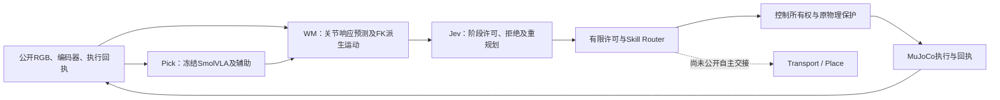

# 三模型阶段监督与v2技能研究 · 2026-10-10

本目录发布实际运行版本的源码快照、精简实验记录及长路径指令。当前已验证的是**已知MuJoCo开发场景的拿起保持**与**保存持物状态下的局部末端跟踪**。完整Transport、公开自主技能交接、Place与实机仍未通过。

## 已取得结果

| 分支 | 实际结果 | 证据边界 |
| --- | --- | --- |
| v1三模型阶段监督 | 34块、10880步；10.880秒拿起保持通过；末1秒最低抬升92.873mm、变化0.801mm | 8.320秒原评价失败；完整轨迹与VLA加辅助成功基线一致，未证明监督提升成功率、安全性或泛化 |
| v2固定结构重力前馈 | 相同初态、名义目标及0.640秒窗口，位置误差3.202→0.196mm；朝向0.000925rad；640/640步双指接触且无其他支撑 | 保存的历史持物状态；仅约3.19mm的局部EE跟踪通过，不是自主Transport |
| 长路径静态检查 | 70mm完整前缀：128条、16块、名义5.120秒；名义路径与伺服代理静态检查通过 | 无新物理执行；未来实际编码器、伺服、动力学及连续碰撞仍需验证 |
| 80mm候选路径 | 第133条在约70.726mm处J5超过机械1.57rad上限 | 旧IK使用±2.2rad指令范围；不能将80mm的旧端点检查当作机械合法性证明 |

v1实际调用：VLA34次、WM91次、Jev6次（3次目标判断＋3次阶段授权）；含加载启动墙钟194.669秒。3次授权均批准，在0、4.160、9.280秒绑定实际执行，6.400秒正常内部交还，终端保持执行5块。上述时刻是实测事件记录，不是供新任务硬编码的触发常量。

## 分工与源码



- [v1/runtime](v1/runtime)：通过的阶段监督、复合权限、夹爪接续与终端保持源码快照。
- [v2/runtime](v2/runtime)：Skill Router、技能生成器、证据接口、模型桥、独立Transport保护与重力前馈源码快照。
- [gravity_feedforward.py](v2/runtime/gravity_feedforward.py)：`u_arm = q_nom + g_known(q_public)/100`，每40ms读取有效公开编码器，夹爪目标不变。固定结构以外的未知负载、移动夹指及接触力不用于在线补偿。
- [source_provenance.json](source_provenance.json)：来源与发布SHA-256。源码逐字节保留；JSON仅替换机器专属路径前缀，保留原始来源指纹及发布指纹。

这些是**研究运行版本的归档**，没有接入仓库固件、ROS或实机启动链。原在线运行器需要未发布的权重、原登记场景网格、历史状态及有限授权配置；不能把源码快照存在等同于开箱运行或新执行批准。v2完整抓放入口尚未取得能力通过结果。

## 不推进物理的复核入口

仅需Python与NumPy：

```bash
python -m pip install numpy
python model/three_model_training/experiments/skill_supervision_20261010/verify_published.py
```

复核发布文件指纹、Python语法、两个评价终点、前馈对照数值、70mm指令与机械范围、跨块连续性及静态记录绑定。不会调用神经模型、MuJoCo、机械臂或重新运行历史实验。几何结果是已执行静态检查的归档，以上入口不重新认证连续路径安全。

原完整静态检查器保存在[long_path/archive/check_long_path.py](long_path/archive/check_long_path.py)，需要原工作目录和场景资产。它复用原IK，不新增求解或物理步。

## 记录与待确认事项

- [v1实际结果](evidence/v1_result.json)；[局部前馈对照](evidence/feedforward_comparison.json)。私有接触/高度只作事后评价，不构成在线完成信号。
- [长路径结果](long_path/path_result.json)；[关节与端点审查](long_path/endpoint_audit.json)；[完整指令审查](long_path/command_audit.json)。80mm候选仅供诊断，不能执行越限段。
- [70mm名义前缀](long_path/static_legal_prefix_nominal.npz)不是未来实际伺服矩阵；实际前馈必须读取当次新编码器。
- [下一次局部仿真登记](long_path/next_local_simulation_registration.json)：70mm路径加固定响应尾，共136条、5440步、5.440秒、120秒墙钟；**待确认且未执行**。旧16×7／640步许可不能复用，必须另行接入新的有限执行门；原限位与几何规则不放宽。
- [公开持物证据缺口](public_evidence/coverage_summary.json)：共同运动残差不能区分持物与支撑；已有空夹资料应优先只读利用。自动Transport交接与Place释放仍关闭。
- [最小后续采集方案](public_evidence/minimal_collection_plan.json)仅是提案，没有新采集授权。

速度、加速度、跟踪误差与滑移界限仍未校准。单次Jev约十几秒的阶段判断不是0.320秒实时控制；等待时暂停仿真不能推论真实物理世界可以安全暂停。黑色方块扰动、新Place VLA训练、实机运动及烧录均未开展。
